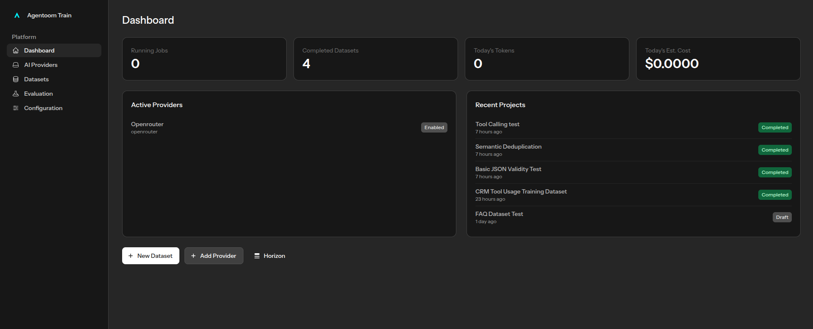
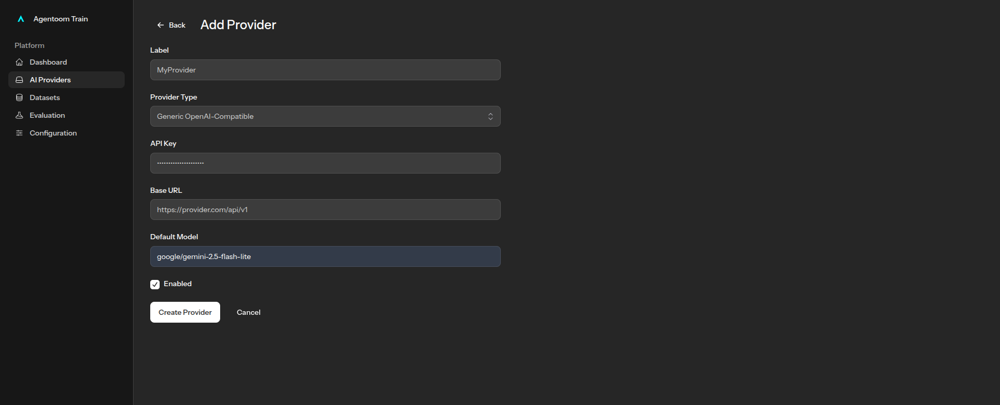
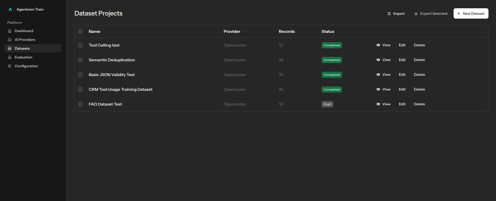
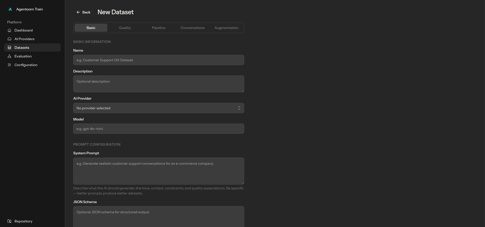
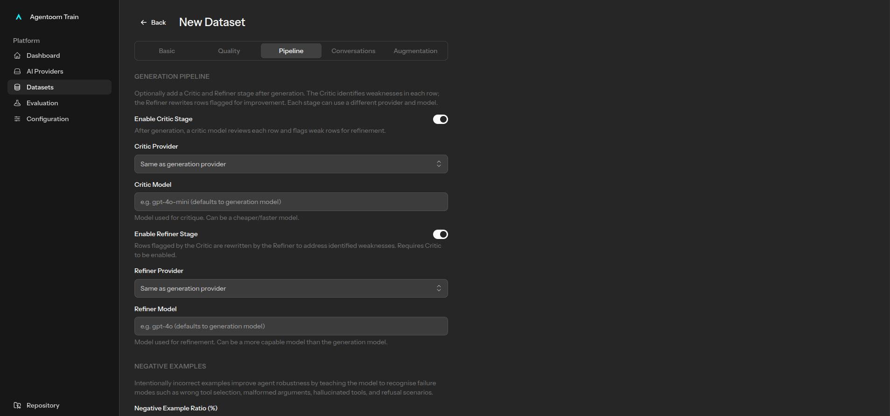
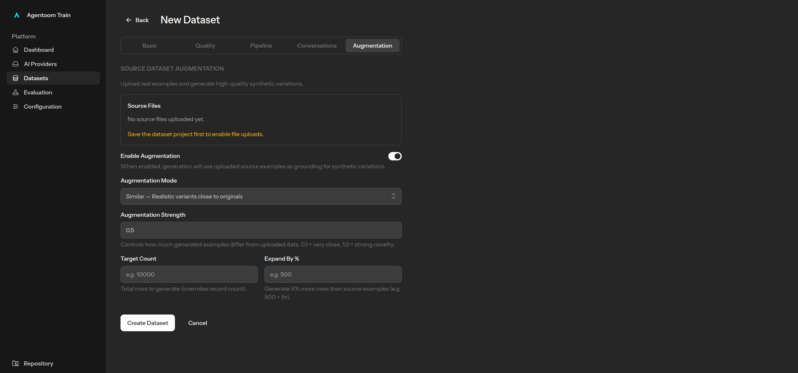
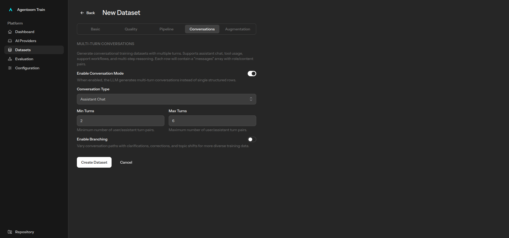
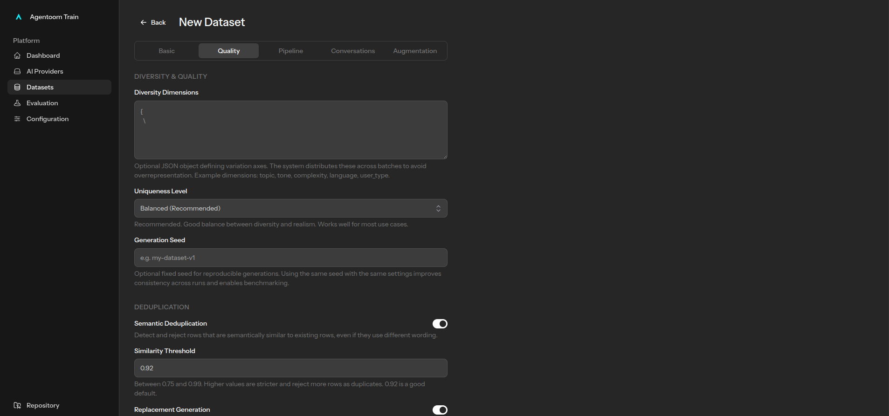
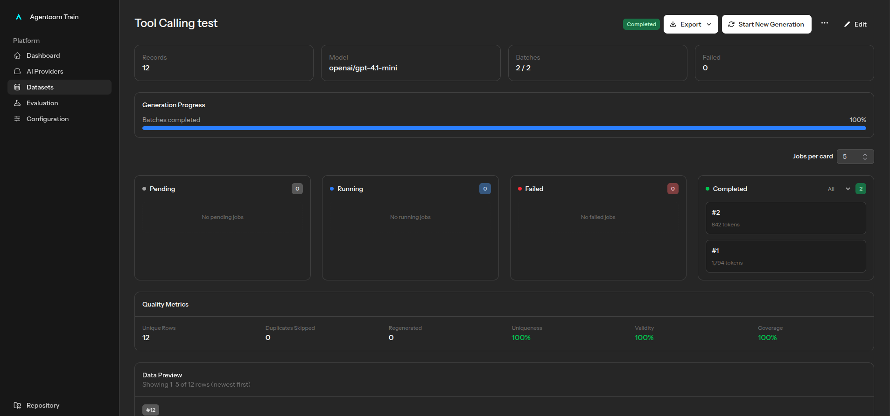

# Agentoom Train

> A configurable dataset generation, refinement, and evaluation system built for the Agentoom ecosystem.

Originally developed while building Agentoom after repeatedly encountering unreliable tool-calling behavior and fragmented dataset workflows. What started as a collection of disconnected tools and CLI commands became the first version of a unified dataset engineering system.

**Website:** [https://agentoom.com](https://agentoom.com)

---

# Quick Start



### Requirements

- [Docker](https://www.docker.com/)
- [Docker Compose](https://docs.docker.com/compose/)

This project runs inside **[Laravel Sail](https://laravel.com/docs/sail)**, a Docker-based development environment for Laravel. You do not need PHP, Composer, or Node installed locally — everything runs inside containers.

### Setup

```bash
# Optional: create a convenient alias so you can type `sail` instead of `./vendor/bin/sail`
alias sail='sh $([ -f sail ] && echo sail || echo vendor/bin/sail)'

# Install PHP dependencies (requires local Composer or use the Docker bootstrap)
composer install

# Copy the environment file and start the containers
cp .env.example .env
./vendor/bin/sail up -d

# Generate the application key, run migrations, and install the default superadmin
./vendor/bin/sail artisan key:generate
./vendor/bin/sail artisan migrate --seed
./vendor/bin/sail artisan agentoom-train:install
```

The install command creates a default superadmin account and imports the bundled example datasets:

- **Email:** `superadmin@agentoom.com`
- **Password:** `changeme`

*Change the password after first login*

### Configure an AI Provider

Before generating datasets you need to connect at least one AI provider.

Open the application, go to **[AI Providers](http://localhost/providers)** in the sidebar, and add your API key.

#### Supported providers



| Provider | Status | Notes |
|---|---|---|
| **OpenRouter** | ✅ Tested | Recommended. Gives access to hundreds of models via a single API key. |
| **Generic OpenAI-compatible** | ✅ Tested | Any endpoint that speaks the OpenAI API format (e.g. local Ollama, vLLM, LM Studio). |
| **OpenAI** | ⚠️ Supported, not fully tested | Should work — uses the same OpenAI SDK driver. |
| **Anthropic** | ⚠️ Supported, not fully tested | Claude models via the Anthropic API. |

> **Note:** OpenRouter and generic OpenAI-compatible endpoints have been validated end-to-end. OpenAI and Anthropic direct integrations are wired up but have not been extensively tested in production workflows. If you encounter issues, please open an issue.

---

### Semantic similarity & vector search

The system uses **[Typesense](https://typesense.org/)** as a vector search engine to compute semantic similarity between dataset rows.

#### How it works

1. When dataset rows are indexed, each row's `payload_text` field (a normalised text representation of the row content) is automatically embedded by Typesense using the built-in `ts/all-MiniLM-L12-v2` sentence-transformer model.
2. The resulting embedding is stored in the `payload_embedding` field (a float vector) alongside the original text.
3. During evaluation and duplicate detection, the system queries Typesense using **vector nearest-neighbour search** on `payload_embedding` to find rows that are semantically similar — even if they use different wording.
4. The returned similarity scores are stored on each row as `source_similarity_score` and consumed by the `EdgeCaseEvaluator` and `DistributionDriftEvaluator` to measure dataset diversity and detect near-duplicate content.

This means duplicate detection goes beyond exact string matching — two rows that express the same idea in different words will still be flagged as similar.

#### Configuration

Typesense connection settings live in `config/scout.php` and are controlled via environment variables:

```env
SCOUT_DRIVER=typesense
TYPESENSE_HOST=localhost
TYPESENSE_PORT=8108
TYPESENSE_API_KEY=your-key
TYPESENSE_EMBEDDING_MODEL=ts/all-MiniLM-L12-v2
```

The embedding model runs **inside Typesense** — no external embedding API call is made.

---

# What is this?



Building reliable AI systems is not only about choosing the right model.

In practice, most failures happen because of:

* inconsistent datasets
* poor data quality
* weak edge-case coverage
* unbalanced examples
* lack of evaluation
* no structured refinement process

The **Agentoom Train** was created to solve this problem.

Instead of simply generating synthetic data, it provides a **complete dataset engineering workflow**:

```text
Define → Generate → Critique → Refine → Evaluate → Improve → Version
```

The system is designed to support **virtually any structured dataset**, using:

* prompts
* JSON schemas
* configurable generation pipelines
* critic/refiner stages
* evaluation systems
* feedback loops

---

# Why this exists

This system was originally built as part of the **Agentoom ecosystem** to support:

* AI agent training
* workflow intelligence
* automation systems
* structured reasoning datasets
* conversational datasets
* evaluation datasets
* fine-tuning preparation

Over time, it evolved into a reusable dataset engineering platform.

It is now being opened to the community for testing and collaboration.

---

# Core philosophy

Most synthetic dataset tools work like this:

```text
Prompt → Generate → Export
```

This engine follows a different approach:

```text
Objective
    ↓
JSON Schema
    ↓
Configurable Generation
    ↓
Critic Pipeline
    ↓
Refinement Pipeline
    ↓
Evaluation
    ↓
Failure Analysis
    ↓
Improvement Signals
    ↓
Dataset Versioning
```

The goal is not simply to generate data.

The goal is to create **higher quality, measurable, improvable datasets**.

---

# What can it generate?

The system is intentionally open-ended.

There are no predefined dataset types.

You define what you want through:

* prompts
* instructions
* JSON schemas
* pipeline settings

Examples include:

* conversational datasets
* instruction-following datasets
* classification datasets
* extraction datasets
* synthetic business scenarios
* benchmark datasets
* agent simulations
* evaluation datasets
* edge-case datasets
* structured reasoning examples
* domain-specific datasets

If it can be represented as structured data, it can be generated.

---

# How it works

## 1. Define the dataset objective

Describe the dataset you want to create.

Examples:

* customer support simulations
* business workflow scenarios
* legal extraction datasets
* medical classification examples
* agent tool-calling datasets
* structured QA systems
* adversarial or edge-case examples

The system is prompt-driven and intentionally flexible.

---

## 2. Define the output structure

Provide a **JSON schema** describing the expected structure of each dataset row.

Example:

```json
{
  "customer_message": "string",
  "intent": "string",
  "sentiment": "string",
  "response": "string"
}
```

The engine uses schema constraints to keep outputs structured and consistent.

---

## 3. Configure the dataset pipeline

The dataset generation process is highly configurable.



### Generation controls

Configure:

* generation instructions
* synthetic generation behavior
* dataset size
* batch behavior
* prompt strategies
* schema enforcement

---

### Critic & refinement pipeline



Generated rows can pass through a **quality control system**.

The pipeline includes:

#### Critic stage

Responsible for:

* detecting low-quality rows
* identifying inconsistencies
* validating structure
* detecting weak examples
* flagging failures

#### Refiner stage

Responsible for:

* correcting weak outputs
* rewriting invalid rows
* improving consistency
* refining examples
* increasing overall quality

This creates a more reliable dataset than simple one-shot generation.

---

### Negative example handling

Supports:

* configurable negative example ratios
* balanced positive/negative examples
* difficult examples
* adversarial examples
* robustness-oriented datasets

---

### Real-case augmentation



Upload real-world examples to:

* improve realism
* reduce synthetic drift
* inject domain-specific behavior
* augment generated data
* improve edge-case coverage

---

### Conversation generation



Supports:

* single-row datasets
* multi-turn conversations
* dialogue simulation
* structured conversational datasets

---

## 4. Evaluate dataset quality

The system includes **two separate evaluation layers** that serve different purposes.

---

### Per-row quality gate (Phase 1) — LLM-based

During dataset **generation**, each row is evaluated by an **AI model** (LLM).

This evaluation is configured per dataset project. You can set the `evaluation_model` and `minimum_quality_score` in the dataset settings.



How it works:

1. A prompt is built asking the LLM to score the row (0–100) and return structured JSON with `score`, `reasoning`, and `issues`
2. The configured AI provider (e.g. GPT-4o-mini, Claude, etc.) is called
3. Rows that score below `minimum_quality_score` are rejected and optionally regenerated

This is a **per-row, real-time quality gate** that runs automatically during generation.



---

### Governance evaluation (Phase 1.5) — Pure code, no LLM

After generation, you can run a **dataset-level governance evaluation** from the **Evaluation** page in the sidebar.

This evaluation is **entirely deterministic and rule-based** — no AI model is called.

#### How to trigger it

1. Open the application and click **Evaluation** in the sidebar
2. Select a dataset version from the dropdown
3. Click **Run Evaluation**

#### What happens internally

```text
DatasetVersion (read-only)
        ↓
DatasetBatchDTO (all rows loaded)
        ↓
EvaluationPipeline (5 evaluators run in sequence)
        ↓
BatchEvaluationResultDTO (aggregated scores)
        ↓
DatasetEvaluationReport (persisted to database)
```

#### The 5 evaluators

Each evaluator declares a **weight** and an **applicability rule**. Evaluators that are not applicable to the dataset type are skipped and excluded from scoring — they never penalise the dataset.

| Evaluator | Weight | Applicable when | What it checks |
|---|---|---|---|
| `TaskPerformanceEvaluator` | 3 (critical) | Always | Row validity, evaluation failures, quality scores |
| `DistributionDriftEvaluator` | 2 (critical) | Always | Duplicate rate (calibrated curve), field coverage drift |
| `EdgeCaseEvaluator` | 2 | `dataset_type` ∉ `classification`, `extraction`, `structured_output` | Source similarity diversity, critic feedback coverage |
| `ConversationQualityEvaluator` | 1 | `conversation_enabled = true` | Turn counts, message structure, refinement rate |
| `NegativeRatioEvaluator` | 1 | `negative_example_ratio > 0` | Negative example ratio within configured bounds |

When an evaluator is **not applicable**, its report shows:

```text
status: not_applicable
reason: <why it was skipped>
excluded from scoring: true
```

#### Scoring

- **Overall score** = weighted average of **applicable evaluators only** (0–100)
- Not-applicable evaluators contribute `score = null` and are fully excluded from the average

#### Pass/fail logic

- **Passes** if: `overall_score ≥ 60` **and** no *critical* evaluator scores below 35
- Only `TaskPerformanceEvaluator` and `DistributionDriftEvaluator` are critical — non-critical evaluators cannot hard-fail a dataset on their own

#### Quality bands

| Score | Band |
|---|---|
| 90–100 | Excellent |
| 75–89 | Strong |
| 60–74 | Good |
| 40–59 | Weak |
| 0–39 | Poor |

#### Duplicate rate scoring (calibrated curve)

| Duplicate rate | Score range |
|---|---|
| 0–3% | 95–100 |
| 3–7% | 80–95 |
| 7–15% | 60–80 |
| 15–25% | 40–60 |
| 25%+ | 0–40 |

#### Evaluation report

After evaluation, a `DatasetEvaluationReport` is saved with:

- `overall_score` — weighted aggregate score (0–100), applicable evaluators only
- `passed` — boolean pass/fail
- `verdict` — human-readable summary including quality band, skipped evaluators, and improvement suggestions
- `evaluator_scores` — per-evaluator breakdown including `status`, `weight`, `score`, `summary`, and `details`
- `duplicate_rate` — detected from the distribution drift evaluator
- `metadata.quality_band` — one of: Excellent, Strong, Good, Weak, Poor
- `metadata.skipped_evaluators` — map of evaluator → reason skipped

#### Version comparison & release

Once you have evaluation reports, you can compare versions and promote passing ones:

```php
use App\Models\DatasetVersion;
use App\Services\DatasetEvaluation\DatasetEvaluationService;

$service = app(DatasetEvaluationService::class);

// Compare two versions
$result = $service->compare($baseline, $candidate);
// $result['improved'] = true/false

// Promote a passing report to a named release
$release = $service->release($report, 'v1.0.0', 'First stable release');
```

A release can only be created if the evaluation **passed**.

---

#### Summary: which system evaluates what?

| System | When | Who evaluates |
|---|---|---|
| Per-row quality gate (Phase 1) | During generation, automatically | **LLM** (your configured AI provider) |
| Governance evaluation (Phase 1.5) | On demand, via Evaluation page | **Pure code** (rule-based, no LLM) |
| Feedback signals (Phase 1.6) | Optional, after Phase 1.5 | **Pure code** (deterministic signal builder) |

---

## 5. Analyze failures & improvement opportunities

The system can identify:

* weak areas
* evaluator failures
* quality bottlenecks
* low-diversity regions
* structural weaknesses

And produce:

* root-cause analysis
* structured feedback
* improvement signals
* version-to-version comparisons

---

# Full lifecycle

```text
Define Objective
        ↓
Define JSON Schema
        ↓
Configure Dataset Pipeline
        ↓
Generate Dataset
        ↓
Critic Stage
        ↓
Refinement Stage
        ↓
Evaluate Dataset
        ↓
Analyze Weaknesses
        ↓
Improve Next Version
```

---

# Current status

Current implemented phases:

### Phase 1 — Dataset Creation Engine

* synthetic generation
* augmentation
* schema-driven outputs
* conversation generation
* negative examples

### Phase 1.5 — Evaluation Layer

* dataset scoring
* evaluator pipelines
* quality checks
* drift analysis
* release/version support

### Phase 1.6 — Feedback Layer

* failure analysis
* root-cause detection
* structured improvement signals

---

# Roadmap

Planned roadmap:

### Phase 2

Training integration:

* HuggingFace support
* model training orchestration
* model registry
* dataset → model lineage tracking

### Future phases

* adaptive dataset tuning
* dataset planning intelligence
* feedback-driven optimization

---

# Looking for testers

This project is being shared early because real-world feedback matters more than assumptions.

We are looking for:

* AI builders
* ML engineers
* Laravel developers
* Python developers
* people fine-tuning models
* teams building AI agents
* developers generating synthetic datasets

If you are experimenting with AI datasets, your feedback would be incredibly valuable.

Especially interested in:

* edge cases
* bugs
* broken assumptions
* difficult domains
* scalability feedback
* UX improvements
* evaluation accuracy

Please open an issue and share:

* what you tried to build
* what worked
* what failed
* what felt confusing
* what you expected differently

---

# About Agentoom

This project belongs to the **Agentoom ecosystem**.

Agentoom is an AI platform focused on intelligent automation, orchestration, and AI-driven workflows.

Learn more at:

https://agentoom.com

This dataset engine is one of the core systems developed to support the future of Agentoom.

---

# Contributing

Feedback, bug reports, testing, criticism, and ideas are welcome.

The goal is to make dataset engineering more reliable, measurable, and improvable for everyone building AI systems.

If you break it, please tell us.
